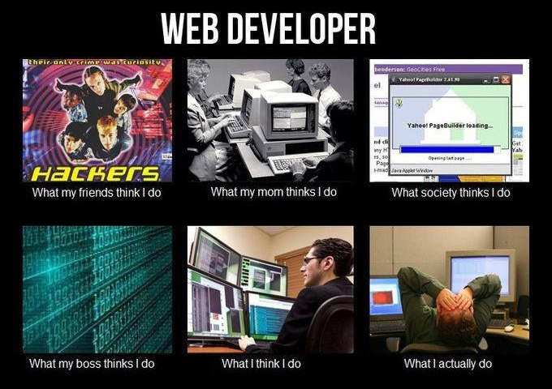

# WEEK 02

## Agenda
1. Research Presentation Assignments
2. Checkout Houses
3. Variables, Datatypes, Motion, User Input, Conditionals?
4. Challenge 01 - Collision? 
5. Assignment 02 - Basic Game/Drawing Application

## Research Assignment

Siebren Versteeg & Casey Reas - 

## House Drawings

#### Observations:

* variables
* the `map()` function
* commenting
* motion

## Coding Topics



### Variables

Variables are containers for storing values. In Processing, these variables have a range of different types. These types need to be specified when a variable is declared. Declaring a variable is done like this:

`int myVariable;`

Our variable, `myVariable`, is of type `int`, and since we didn't initialize it, it's uninitialized.

We can initialize it like so:

`int myVariable=0;`

---

### Datatypes

Since Procesing is built on Java, it uses most all the same datatypes you'll find in Java. Here are some of the basics:

* `int` Whole numbers
* `float` Numbers with decimal points
* `boolean` true or false
* `char` a single character
* `String` a composite of characters
* `color` int that Procesing treats like a 32bit ARGB color value
* `byte` an 8 bit value

---

### Operators

Computers are made to manipulate numbers. We use oprators to performa various manipulations. Some simple ones that we are more familiar with:

* `+` Addition
* `-` Subtraction
* `*` Multiplication
* `/` Division

Some more advanced operators:

* `%` Modulo
* `<<` Shift left
* `>>` Shift right
* `|` OR
* `&` AND
* `^` XOR

---

### Movement

#### Linear Motion

Let's start with this basic sketch. Copy paste into Processing.

```
// declare vairables
float x,y;
float r = 15;

void setup(){

  // set screen size
  size(500, 500);
  
  // initialize variables
  x=width/2;
  y=height/2;
  
  // set starting background color
  background(255);
}

void draw(){
  
  // blank out canvas
  background(255);
  
  // style our shape
  strokeWeight(1);
  stroke(0);
  fill(127);
  
  // draw shape
  ellipse(x,y,2*r,2*r);
}

```


#### Cyclical Motion

Let's start with this code. It's not perfect so we'll have to change some things.

```
// declare vairables
float x,y;
float r = 15;
float speed = .01;
float angle = 0;

void setup(){

  // set screen size
  size(500, 500);
  
  // initialize variables
  x=width/2;
  y=height/2;
  
  // set starting background color
  background(255);
}

void draw(){
  
  // blank out canvas
  background(255);
  
  // style our shape
  strokeWeight(1);
  stroke(0);
  fill(127);
  
  // update the motion
  x=100*sin(angle);
  y=100*cos(angle);
  angle+=speed;
  
  // draw shape
  ellipse(x,y,2*r,2*r);
  
}

```
---

### Arrays

The easiest way to think about arrays is to treat them like lists. Arrays can be made using any datatype.

```
float[] myValues;

void setup(){
	size(100,100);
	myValues = new float[100];
}
```

---
### Interaction

#### Mouse Input

* mouseButton
* mouseClicked()
* mouseDragged()
* mouseMoved()
* mousePressed()
* mousePressed
* mouseReleased()
* mouseWheel()
* mouseX
* mouseY
* pmouseX
* pmouseY

```
// declare vairables

void setup(){

  // set screen size
  size(500, 500);
  
  // set starting background color
  background(255);
}

void draw(){
  
  // blank out canvas
  background(255);
  
  // style our shape
  strokeWeight(1);
  stroke(0);
  fill(127);
  
  // draw shape
  ellipse(mouseX,mouseY,2*r,2*r);
  
}
```


#### Keyboard Input

* key
* keyCode
* keyPressed()
* keyPressed
* keyReleased()
* keyTyped()

```
void setup(){

  // set screen size
  size(100, 100);
  
  // set starting background color
  background(255);
}

void draw(){
  
  // blank out canvas
  background(255);
  
}

void keyPressed(){
  println("Key pressed: "+key);
  println("Keycode pressed: "+keyCode);
}
```
## Conditionals

### Boolean Logic:

Evaluates a statement based on logical conditions. Common conditionals are:

* `==` EQUAL TO: if the value of A and the value of B are equal
* `!=` NOT EQUAL TO: opposite of `==`
* `&&` AND: if A is true AND B is true
* `||` OR: if A OR B is true
* `<` LESS THAN
* `<=` LESS THAN OR EQUAL TO
* `>` GREATER THAN
* `>=` GREATER THAN OR EQUAL TO

### `if` statements

Oftentimes we want parts of our code to execute based upon a condition. `if` statements are a simple way to do this: 

```
// a simple if statement:
if(someCondition) doThis();

// when executed code is more than one line
if(someCondition){
	doThis();
	doSomethingElse();
}

// simple if else
if(someCondition){
	doThis();
} else {
	doThat();
}

// simple example of else if
if(someCondition){
	doThis();
} else if (anotherCondition) {
	doThat();
} else {
	doWhatever();
}
```

### `while` loops

Be careful with these. If your condition is never met, then the while loop never exits!

```
while(someCondition){
	doThis();
}
```

### `for` loops

For iterating through a number of things or doing something a fixed number of times, use the `for` loop. It's basic construction is:

```
for(int counter = 0; counter < number_of_iterations; counter++){
	doThis();
}
```
In this structure, we declare a counter or index, in this case `counter` and initialize it to `0`, though we could initialize it to any value we want. We then execute the code in a loop and increment the counter by 1 each time using `counter++`. We do this so long as the counter is less than `number_of_iterations`.

`for` loops are useful for interating through an array:

```
for(int i = 0; i < 100; i++){
	println(myListOfStrings[i]);
}
```

### `switch` structures

If you find yourself using complicated `if else` chains, maybe you should consider using a switch.

```
switch(key){

	case 'a':
		println("Holy smokes! You pressed: "+a);
		break;
	
	default:
		println("Sorry... I'm not into that key...");
		break;
		
}
```
## Challenge

Do we know enough to make a simple collision detection engine?

**Step 1.** See if you can define a region with a shape, and then detect whether the mouse is positioned over it. Give the user some feedback.

**Step 2.** Set an object in motion and see if you can get it to stay on screen.

**Step 3.** Set two objects in motion and make them change directions when they come in contact.

## Assignment 02

Make a simple game that takes user input and uses a simple collision detection engine.