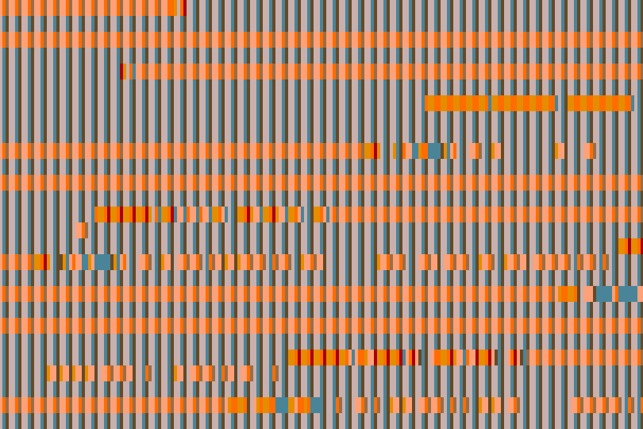
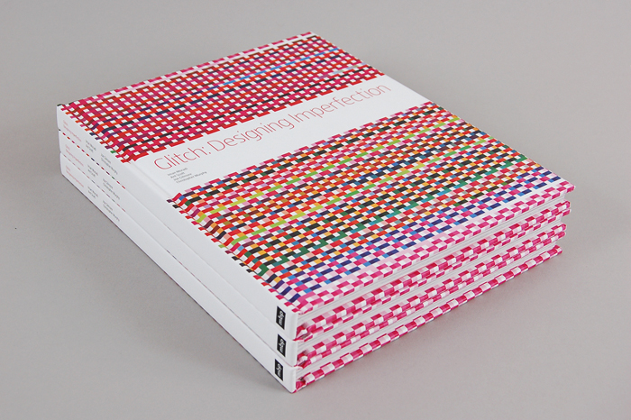
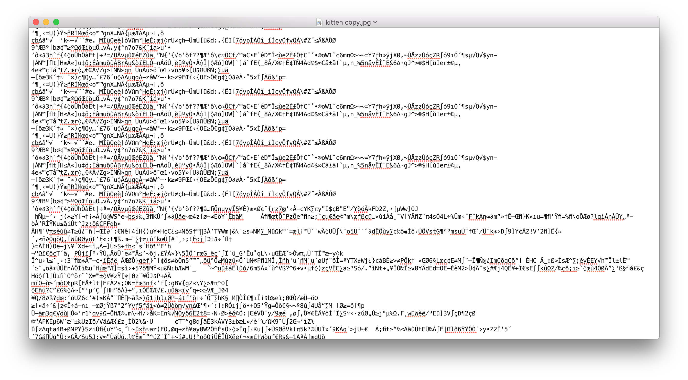
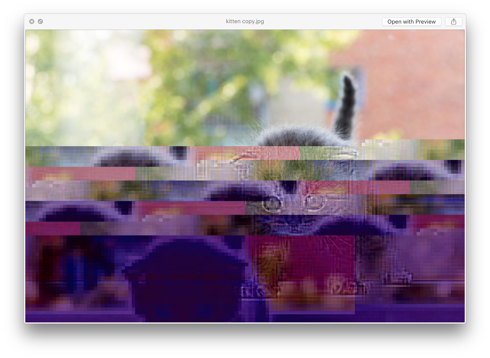

# Week 07

## Agenda

* Midterm Code Therapy Session ;)
* Glitch Art
* Pixel Sorting
* PVectors and ArrayLists
* Iris Chen's Presentation

## Midterm Code Therapy (30 mins)

* Break into groups of three
* Discuss your projects
* Share your code samples
* Talk about challenges you're facing

## Class Feedback (30 mins)

* Pose a question to the class
* Get feedback on your project or a problem
* Need guidance for next steps?

## Glitch Art (at a glance)

An art of artifacts? What is a glitch? What drove artists to work with what seem like errors?

The topic of Glitch Art is sprawling and cannot be adequately covered in depth in a single class. This is meant to provide a starting point for aesthetic exploration of coding principles starting from an unlikely place, but perhaps a familiar one, where things break and fail.

### Origins?

Artists have long ben working with notions of failure and artifacts particular to the materials they work with. This is not really what makes Glitch Art unique. Kim Cascone's Perspective is instructive, that Glitch Art, like Glitch Music, or the turn towards the failures inherent to digital tools and media, is a Post-Digital form. That is, what distinguishes Glitch Art from other forms of art that are concerned with material artifacts, failure, or noise is that inherently grapples with how these manifest in digital tools, systems, and material.

[Ant Scott](http://www.beflix.com), AKA Beflix

>Ant Scott (UK, 1971 –) is a glitch artist, who in 2001 coined the term "Glitch Art", created the first website devoted to visual glitches [1] and presented at the first international glitch-themed conference, held in Oslo the following year [2]. He edited the first coffee table book on glitch aesthetics [3]. 

### Glitch Music

>Glitch is a genre of electronic music that emerged in the 1990s. It has been described as a genre that adheres to an "aesthetic of failure," where the deliberate use of glitch-based audio media, and other sonic artifacts, is a central concern.[1] 

[Kim Cascone](https://en.wikipedia.org/wiki/Kim_Cascone)

The Aesthetics of Failure, by Kim Cascone was published in the Computer Music Journal Volume 24 | Issue 4 | Winter 2000 p.12-18.

In this work he contextualizes the emergence of what he identifies as a Post-Digital aesthetic in electronic music as a confluence of ideas in past art historic and experimental music traditions concerned with failure, chance, and background.

The emergence of a music that embraces the unique qualities of a material as it decays or is acted upon physically forms the basis for much of what was known as Glitch Music. Artists releasing these albums worked with visual artist for their cover art. Many of these artists were the original Glitch Artists, Ant Scott amongst them.

### Art of Glitch

Iman Moradi co-authored and edited [Glitch: Designing Imperfection](https://www.amazon.com/gp/product/0979966663/ref=dbs_a_def_rwt_hsch_vapi_taft_p1_i0), with Ant Scott and Christopher Murphy (published in 2009 by Mark Batty Publishers). The first coffee table on Glitch Art, Designing Imperfection documented the beginnings of glitch art through images and interviews with many of the key pioneering figures.

### GLI.TC/H

An festival that took place in 2010, 2011, and 2012

Organized by a core group that included Nick Briz, Rosa Menkman and Jon Satrom, and Evan Meaney. It started in Chicago, IL, expanding to Amsterdam, NL and Birmingham, UK in 2011, and returning to Chicago in 2012.

### Vernacular of File Formats

Rosa Menkman published [A Vernacular of File Formats](https://www.dropbox.com/s/r2an9biuttqpx0c/hifi%20Rosa%20Menkman%20-%20A%20Vernacular%20of%20File%20Formats.pdf?dl=0) a PDF detailing her exploration of file formats undergoing various types of corruption.

Glitches are inherently unstable things implicating an ecosystem of structures and systems:

* The File Format and Structure
* Physical Media
* Rendering Software
* The Operating System
* Transmission Format and Method
* Display Hardware

Much of the work of Glitch Artists has been in destabilizing any one of these and capturing the output.

One of the most basic examples of creating Glitch Art involves opening an image in a text editor, copying and pasting the text, and then saving it as an image again:

### Automated File Corruption

* 

In addition to copying and pasting chunks of raw image data, it's possible to use the find and replace feature of many text editors to alter the image data byte by byte. This effect as a far more drastic impact as it's changing a large percentage of data.

### Anatomy of a JPG

If you wish to target specific parts of a JPG. Ted Davis created [Header Remix](http://www.ffd8.org/header_remix/) an interactive application that you can use to single out and alter bits one value at a time.