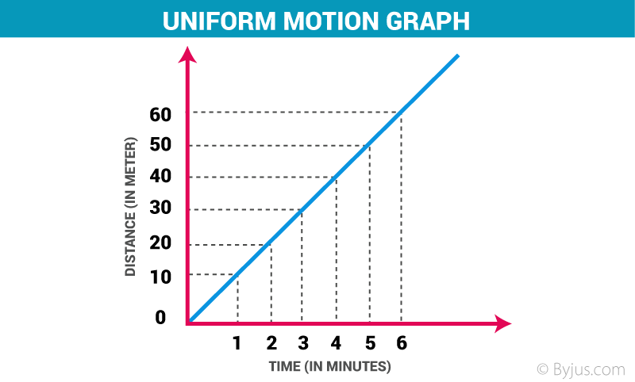
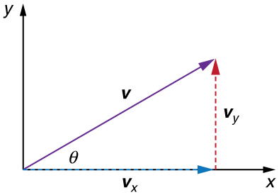
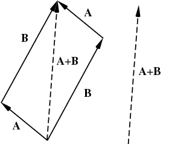
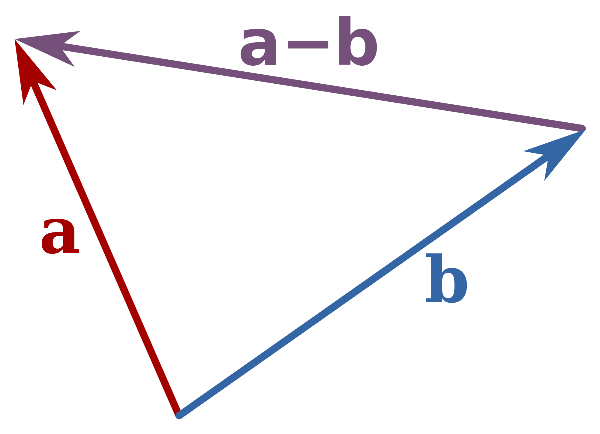

# Week 07

## Agenda

* Midterm Code Therapy Session ;)
* Glitch Art
* Pixel Sorting
* PVectors and ArrayLists
* Iris Chen's Presentation

## Midterm Code Therapy (30 mins)

* Break into groups of three
* Discuss your projects
* Share your code samples
* Talk about challenges you're facing

## Class Feedback (30 mins)

* Pose a question to the class
* Get feedback on your project or a problem
* Need guidance for next steps?

## Glitch Art (at a glance)

An art of artifacts? What is a glitch? What drove artists to work with what seem like errors?

The topic of Glitch Art is sprawling and cannot be adequately covered in depth in a single class. This is meant to provide a starting point for aesthetic exploration of coding principles starting from an unlikely place, but perhaps a familiar one, where things break and fail.

### Origins?

Artists have long ben working with notions of failure and artifacts particular to the materials they work with. This is not really what makes Glitch Art unique. Kim Cascone's Perspective is instructive, that Glitch Art, like Glitch Music, or the turn towards the failures inherent to digital tools and media, is a Post-Digital form. That is, what distinguishes Glitch Art from other forms of art that are concerned with material artifacts, failure, or noise is that inherently grapples with how these manifest in digital tools, systems, and material.


[Ant Scott](http://www.beflix.com), AKA Beflix

>Ant Scott (UK, 1971 –) is a glitch artist, who in 2001 coined the term "Glitch Art", created the first website devoted to visual glitches [1] and presented at the first international glitch-themed conference, held in Oslo the following year [2]. He edited the first coffee table book on glitch aesthetics [3]. 

### Glitch Music

>Glitch is a genre of electronic music that emerged in the 1990s. It has been described as a genre that adheres to an "aesthetic of failure," where the deliberate use of glitch-based audio media, and other sonic artifacts, is a central concern.[1] 

[Kim Cascone](https://en.wikipedia.org/wiki/Kim_Cascone)

The Aesthetics of Failure, by Kim Cascone was published in the Computer Music Journal Volume 24 | Issue 4 | Winter 2000 p.12-18.

In this work he contextualizes the emergence of what he identifies as a Post-Digital aesthetic in electronic music as a confluence of ideas in past art historic and experimental music traditions concerned with failure, chance, and background.

The emergence of a music that embraces the unique qualities of a material as it decays or is acted upon physically forms the basis for much of what was known as Glitch Music. Artists releasing these albums worked with visual artist for their cover art. Many of these artists were the original Glitch Artists, Ant Scott amongst them.

### Art of Glitch


Iman Moradi co-authored and edited [Glitch: Designing Imperfection](https://www.amazon.com/gp/product/0979966663/ref=dbs_a_def_rwt_hsch_vapi_taft_p1_i0), with Ant Scott and Christopher Murphy (published in 2009 by Mark Batty Publishers). The first coffee table on Glitch Art, Designing Imperfection documented the beginnings of glitch art through images and interviews with many of the key pioneering figures.

### GLI.TC/H


An festival that took place in 2010, 2011, and 2012

Organized by a core group that included Nick Briz, Rosa Menkman and Jon Satrom, and Evan Meaney. It started in Chicago, IL, expanding to Amsterdam, NL and Birmingham, UK in 2011, and returning to Chicago in 2012.

### Vernacular of File Formats


Rosa Menkman published [A Vernacular of File Formats](https://www.dropbox.com/s/r2an9biuttqpx0c/hifi%20Rosa%20Menkman%20-%20A%20Vernacular%20of%20File%20Formats.pdf?dl=0) a PDF detailing her exploration of file formats undergoing various types of corruption.

Glitches are inherently unstable things implicating an ecosystem of structures and systems:

* The File Format and Structure
* Physical Media
* Rendering Software
* The Operating System
* Transmission Format and Method
* Display Hardware

Much of the work of Glitch Artists has been in destabilizing any one of these and capturing the output.

One of the most basic examples of creating Glitch Art involves opening an image in a text editor, copying and pasting the text, and then saving it as an image again:


### Automated File Corruption

* [imageGlitcher.pde](https://github.com/pds-nyu-idm-cc/DM-GY-6063-Creative-Coding-Spring-2019-Stearns/blob/master/wk07/examples/imageGlitcher/imageGlitcher.pde)

In addition to copying and pasting chunks of raw image data, it's possible to use the find and replace feature of many text editors to alter the image data byte by byte. This effect as a far more drastic impact as it's changing a large percentage of data.

### Anatomy of a JPG


If you wish to target specific parts of a JPG. Ted Davis created [Header Remix](http://www.ffd8.org/header_remix/) an interactive application that you can use to single out and alter bits one value at a time.

## PVectors and ArrayLists

### Motion


#### Review Coordinates

In Processing, location is in reference to a coordinate system whose unit is the pixel.


We define the location in terms of (x, y) coordinates from the origin, which is the upper left corner of the screen.

#### Review Speed



When we deal with motion, we're dealing with a change in position per unit time.

* In Processing, our unit is the frame.
* Each frame, we want to move some amount.
	* If we want to move in the x-axis, we increment x by some amount
	* If we want to move in the y-axis, we increment y by some amount
	* If we want to move diagonally, we do both together

#### Velocity as a Vector



Vectors are a representation of some magnitude (velocity, acceleration, force, etc) in some direction. In cartesian coordinates, like our pixel matrix in Processing, vectors can be broken down into x and y components.

In the above diagram, vector *v* is represented by *vx* and *vy*, vectors in the x and y directions respectively. They **add** to form vector *v*.

### PVectors

In Processing, the **PVector** class allows us to do vector math easily, a necessary tool for creating dynamic motion.

It has fields that stores coordinates in up to 3 dimensions. We'll deal with 2 for now.

#### Position as a PVector

PVectors can be used to store position as x and y coordinates. Consider the example:

```
PVector position;

void setup(){

	size(500,500);
	position = new PVector(width/2, height/2);
	noLoop();
	
}

void draw(){

	circle(position.x, position.y, 50);
	println("x: "+position.x+", y: "+position.y);
}


```

#### Motion with PVectors



To create motion, we increment the position by some x and y component, whether positive or negative in value. We can represent the velocity of an object by specifying the amount we want it to move in the x and y directions and store those in a PVector.

In order to change the position and create motion, we add the speed vector to the position vector.

```
PVector position;
PVector velocity;

float size = 50;

void setup() {
  size(500, 500);
  
  position = new PVector(width/2, height/2);
  velocity = new PVector(random(-3,3),random(-3,3));
}

void draw() {

  background(127);

  // add the velocity vector to the position
  position.add(velocity);
  
  // collide with edges
  bounce();

  circle(position.x, position.y, size);
  
}

void bounce(){
if ( position.x > width-(size/2) ) {
    position.x = width-(size/2);
    velocity.x *= -1;
  }
  if (position.x < size/2) {
    position.x = size/2;
    velocity.x *= -1;
  }

  if ( position.y > height-(size/2) ) {
    position.y = height-(size/2);
    velocity.y *= -1;
  }
  if (position.y < size/2) {
    position.y = size/2;
    velocity.y *= -1;
  }

}

```

#### Acceleration and Forces


Velocity is the change we apply to position each frame.

Acceleration is the change we apply to velocity each frame.

```
velocity.add(acceleration);
position.add(velocity);

```
We can specify the magnitude of acceleration and its direction to create an effect like gravity.

```
acceleration = new PVector(0, 1);
velocity.add(acceleration);
position.add(velocity);

```

We can calculate acceleration using a familiar equation:

```
force = mass * acceleration

or

acceleration = force / mass
```

If we're dealing with vectors, force can be specified as a vector.

```
PVector force = new PVector(x, y);
acceleration.add(force.div(mass));
velocity.add(acceleration);
position.add(velocity);
```

#### Subtraction



When we want to create a vector that points from one object to another, we use vector subtraction.

* `PVector.sub(position1, position2);` will return a `PVector` that points from `position2` towards `position1` whose magnitude is the distance between them.

We can also simply calculate the distance using the `PVector.dist()` method

#### Scalars and Vectors

We can multiply a vector by a one-dimensional value or a scalar. The math is done to the magnitude of the vector and does not impact its direction.

Processing has a few ways for us to manipulate the magnitude of PVectors:

```
.mult()
.div()
.setMag()
.limit()
```

#### Examples:

* Motion without PVectors
* Motion with PVectors
* Accelerated motion with PVectors

### From Individuals to Arrays to Instances

A singular object can be described in terms of its attributes. A circle has an x and y location as well as a diameter, perhaps a color, maybe even some mass. If it moves it'll have velocity with x and y components.

```
// describe a circle?
float x;
float y;
float speedX;
float speedY;
float mass;
float diameter;

```
This is fine if we're just dealing with one and we know that we're just testing something out, but just like functions allow us to compartmentalize and modularize our code, classes let us create a template for objects we're going to use in different places and in different ways.

#### Classes, Objects and Instances

The concept is simple. Classes are a description of an object. When we use a class in our code, we create an instance of the object it describes.

* Objects have attributes or properties and behaviors
* Classes are descriptions of object properties and behaviors
* Instances are specific objects created in our code

In Java, as with other Object Oriented Programming languages, classes describe objects that share a common set of properties and behaviors.

* Properties are called **fields** and are *variables* that contain data specific to an object.
* Behaviors are called **methods** and are *functions* that perform tasks specific to an object.
* Objects are **defined**  or described by classes.
* Objects are **instantiated** similar to declaring a variable.
* Objects must be initialized using **constructors**, special functions that determine the initial value of fields.

```
// definition of a class

class Object{

	// fields
	float field;
	
	// constructor
	Object(){
		field = 0;
	}
	
	// methods
	void method(){
	}
	
}

// creating an instance of an object of class Object named object

Object object;

// initializing the instance of class Object named object

object = new Object();

// accessing fields

float someVar = object.field;
object.field = someVar;

// calling methods

object.method();
```

### Arrays

Arrays can hold instances of objects of a single class in a single array.

We can then iterate through an array and make changes to various fields and call methods to make changes to all the instances at once. If we only want to update certain instances, we can create if statements to apply certain actions to only instances we want to change.

```
// declare an array of OurClass objects named "ourArray"
OurClass[] ourArray = new OurClass[howMany];

// create instances of OurClass objects and stuff them into the array
for(int i = 0; i < ourArray.length; i++){
	// create an instance of OurClass using the default constructor
	ourArray[i] = new OurClass();
}

// iterating through the array and executing a method on each element
for(int i = 0; i < ourArray.length; i++){
	ourArray[i].someMethod();
}

```


### ArrayLists

ArrayLists are dynamic structures that allow us to add and remove instances. This gives us the ability to scale up and down the number of object instances that are active in our code at different times.

```
// declare an ArrayList of type OurClass, with the name "ourList"
ArrayList<OurClass> ourList;

// creates an empty ArrayList of type OurClass
ourList = new ArrayList<OurClass>();

// adding OurClass instances
for(int i = 0 ; i < 100 ; i++){
	// we use the OurClass() constructor to create an instance of OurClass
	ourList.add( new OurClass() );
}

// long form iterating through (NOT REMOVING ANYTHING)
for (int i = 0; i < ourList.size() ; i++ ){
	OurClass o = ourList.get(i);
	o.someMethod();
}

// short form iterating through 
for ( OurClass o : ourList){
	o.someMethod();
}

// when we need to remove something
for(int i = ourList.size() - 1 ; i >= 0 ; i--){
	OurClass o = ourList.get(i);
	if(o.isDone()){
		ourList.remove(i);
	}
}
```

#### Examples

* Creating a Mover class from the PVector examples
* Using Arrays
* Using ArrayLists