# Week 08

## Agenda

* Announcements/Reminders
* Midterm Project Check-ins
* Topic: Noise
* Research Presentation
* Topic: Pixels and Images

## Midterm Check-In

* Take 5 mins to quickly explain your project:
	1. What are you making?
	2. What have you completed? Share your code.
	3. What are your challenges?
* Give your classmates feedback
	* What did you like?
	* What would you like to see them try?
	* What advice can you give to help with their challenges
	* Is there code of their's you'd like them to explain?

## Noise

Noise is complex and complicated. Culturally it is generally viewed as a disturbance, nuisance, undesired. However, in creative coding, it's everything.

Noise broadly refers to randomness or unpredictability.

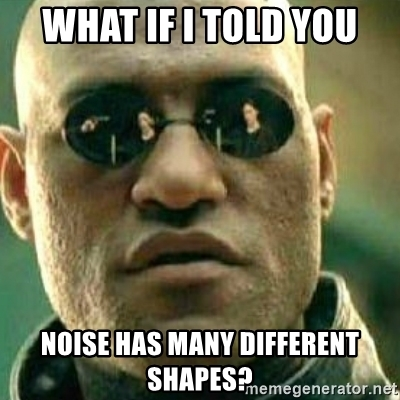

Not all randomness is the same. But to understand why, we have to understand what makes noise, noise.

## Frequency and Fourier Transforms


Simple: A Fourier Transform decomposes a function of time (a signal, e.g. sound) into the frequencies that make it up.

All signals can be described as a sum of different signals of different frequencies at different amplitudes (and phases).

### Sinusoidal Waves ([../wk08/examples/noise/noise01_SineWave/](https://github.com/pds-nyu-idm-cc/DM-GY-6063-Creative-Coding-Spring-2019-Stearns/tree/master/wk08/examples/noise/noise01_SineWave))

A Sinusoid, cosine or sine wave, is the simplest component of a signal. Have a look at the code below:

```
/**
 * Sine Wave
 * by Daniel Shiffman.  
 * 
 * Render a simple sine wave. 
 */
 
int xspacing = 1;   // How far apart should each horizontal location be spaced
int w;              // Width of entire wave

float theta = 0.0;  // Start angle at 0
float thetaStep = 0.0; // Angular Velocity
float amplitude = 100.0;  // Height of wave
float period;  // How many pixels before the wave repeats
float dx;  // Value for incrementing X, a function of period and xspacing
float[] yvalues;  // Using an array to store height values for the wave

void setup() {
  size(640, 360);
  period = width;
  w = width+16;
  dx = (TWO_PI / period) * xspacing;
  yvalues = new float[w/xspacing];
}

void draw() {
  background(0);
  calcWave();
  renderWave();
}

void calcWave() {
  // Increment theta (try different values for 'angular velocity' here
  theta += thetaStep;

  // For every x value, calculate a y value with sine function
  float x = theta;
  for (int i = 0; i < yvalues.length; i++) {
    yvalues[i] = sin(x)*amplitude;
    x+=dx;
  }
}

void renderWave() {
  stroke(255);
  strokeWeight(2);
  // A simple way to draw the wave with an ellipse at each location
  for (int x = 0; x < yvalues.length; x++) {
    point(x*xspacing, height/2+yvalues[x]);
  }
}
```
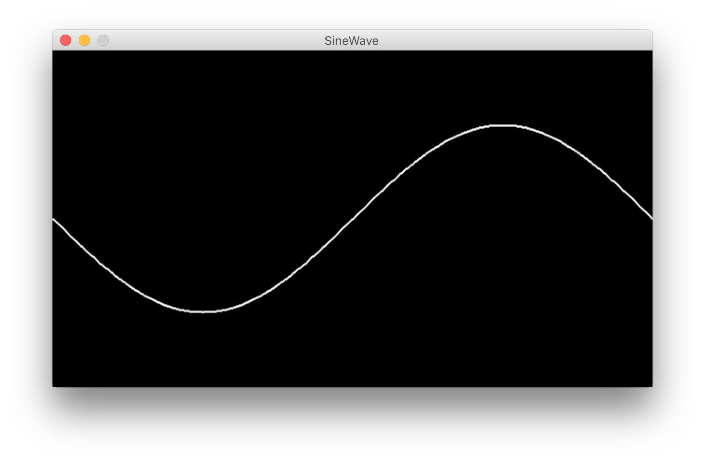

I've modified Daniel's code to create a static sine wave. Important to note:

* theta is the starting angle of the wave
* thetaStep describes the change of that starting angle each frame, creating motion
* x is used to draw subsequent points along the wave, we set it to theta to apply motion to the whole wave
* dx is the frequency of the wave, presently set to 1 cycle per screen width.

## Multiple Components ([../wk08/examples/noise/noise02_SineWave/](https://github.com/pds-nyu-idm-cc/DM-GY-6063-Creative-Coding-Spring-2019-Stearns/tree/master/wk08/examples/noise/noise02_SineWave))

Let's modify it to add an arbitrary number of components and see what the sum of those components is:

```
/**
 * Sine Wave
 * by Daniel Shiffman.  
 * 
 * Render a simple sine wave. 
 */
 
int xspacing = 1;   // How far apart should each horizontal location be spaced
int w;              // Width of entire wave

float theta = 0.0;  // Start angle at 0
float thetaStep = 0.01; // Angular Velocity
int qty_components = 3;
float amplitude = 100/qty_components;  // Height of wave
float period;  // How many pixels before the wave repeats
float[] dx;  // Value for incrementing X, a function of period and xspacing
float[] yvalues;  // Using an array to store height values for the wave

void setup() {
  size(640, 360);
  period = width;
  w = width+16;
  dx = new float[qty_components];
  
  for(int i = 0 ; i < dx.length ; i++){
    dx[i]=((TWO_PI / period) * xspacing)+(random(.05)*i);
  }
  
  //dx = (TWO_PI / period) * xspacing;
  yvalues = new float[w/xspacing];
}

void draw() {
  background(0);
  calcWave();
  renderWave();
}

void calcWave() {
  // Increment theta (try different values for 'angular velocity' here
  theta += thetaStep;

  // For every x value, calculate a y value with sine function
  float[] x = new float[qty_components];
  for (int i = 0 ; i < x.length ; i++){
    x[i] = theta;
  }
  yvalues = new float[w/xspacing];
  for (int i = 0; i < yvalues.length; i++) {
    for (int j = 0 ; j < qty_components; j++){
    yvalues[i] += sin(x[j])*amplitude;
    x[j]+=dx[j];
    }
  }
}

void renderWave() {
  stroke(255);
  strokeWeight(2);
  // A simple way to draw the wave with an ellipse at each location
  for (int x = 0; x < yvalues.length; x++) {
    point(x*xspacing, height/2+yvalues[x]);
  }
}
```

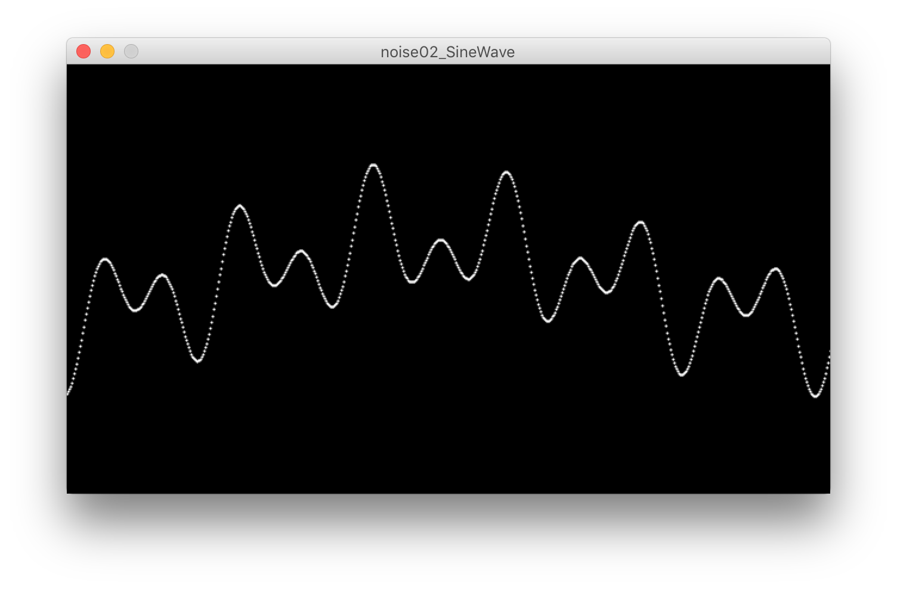

Important changes to note:

* introduction of qty_components
* calculating the amplitude based on number of components
* increased thetaStep from 0.0 to 0.01
* x is now an array that holds the different amplitude each component
* dx is now and array that holds the different frequency values
* the random() function is helping to generate different component frequencies

Run this and play around with the values:

* qty_components
* thetaStep
* `(random(.05)*i` in the line 26

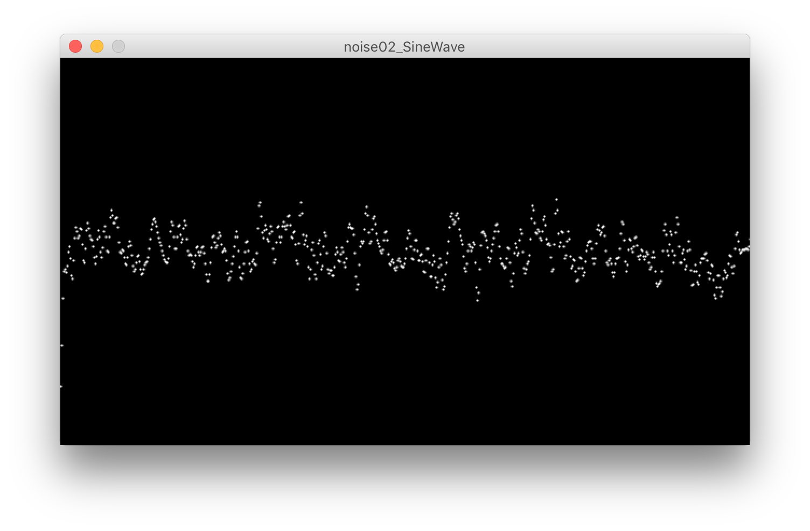

When we have a bunch of different components summed up, we can make a graph of these components by plotting amplitude against frequency. You've already seen this before if you've spent any time with audio visualizers:

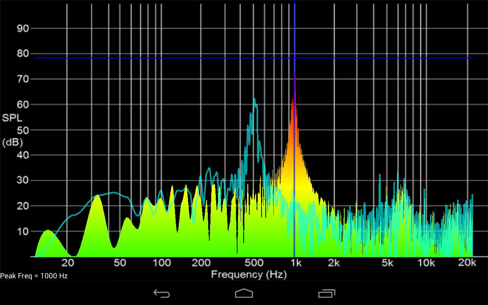

The general shape of this graph, if you trace the peaks averaged over time, you literally get the shape of the average distribution of that signal.

Now check out what happens when you graph the frequency (y) and amplitude (z, color) against time (x):


Spectrographs are not just a handy way for getting a visual fingerprint of a particular signal, but are also a really cool was to visualize wave forms. What would happen if we plotted this graph in three spatial dimensions?

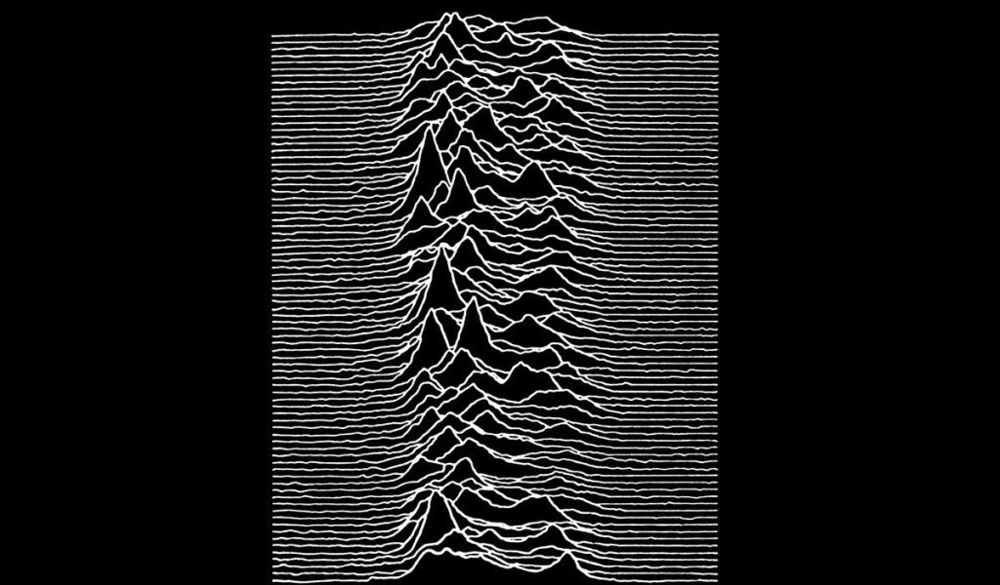

## `random()`

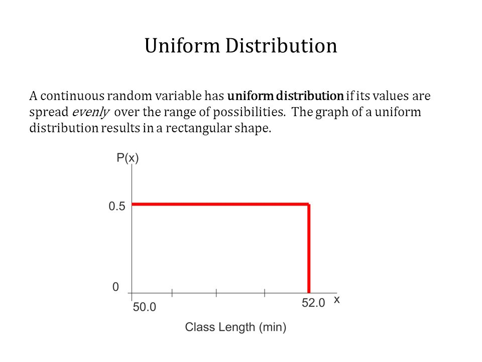

Processing's `random()` function returns random float with a rectangular distribution.

* `random(float)` - returns a value between 0 and float (non-inclusive)
* `random(float1, float2)` - returns a value from float1 and float2 (non-inclusive)
* `randomSeed(int)` - can be called in `setup()` to make sure your "randomness" follows the same progression each time your run your sketch

What would this code do?

```
void setup(){
	# randomSeed(12345);
}

void draw(){
}

void keyPressed(){
  if ( random(1) < 0.5 ) {
    println( "Heads! I win!" );
  } else {
    println( "Tails... You lose! (I WIN!!!)" );
  }
}
```

1. Copy the results into a text editor.
2. Run it again and compare to the copied values.
3. Now uncomment the `randomSeed(12345)` and run it again
4. Repeat steps 1 & 2

## `noise()` Perlin Noise

Perlin Noise is much more complicated and involves the use of a lattice system and a succession of harmonic components to create a more natural randomness.

You can specify noise in up to 3 dimensions:

* `noise(x)`
* `noise(x, y)`
* `noise(x, y, z)`

There are some properties you can adjust:

* `noiseSeed(int)` - use an integer to specify repeatable noise sequence
* `noiseDetail( octaves, falloff)`
	* the more **octaves** (int), the more detail, the slower to calculate
	* **falloff** (float) controls how much each of the octaves contributes

### 1D Example: ([../wk08/examples/noise/noise03_noise1D/](https://github.com/pds-nyu-idm-cc/DM-GY-6063-Creative-Coding-Spring-2019-Stearns/tree/master/wk08/examples/noise/noise03_noise1D))
```
float pos=0.0; // initial position for the noise() function
float dpos=0.01; // the amount we shift the position
float dx=0.025;
float[] yvalues;
float amplitude;
int xspacing = 1;
int w = 0;
int seed = 9999;
int octaves = 3;
float falloff = .5;

void setup(){
  size(600,300);
  background(0);
  w = width+xspacing;
  yvalues=new float[w/xspacing];
  amplitude=height/2;
  noiseSeed(seed);
  noiseDetail(octaves, falloff);
}

void draw(){
  background(0);
  calcNoise();
  renderNoise();
}

void calcNoise(){
  pos += dpos;
  float x = pos;
  for(int i = 0; i < yvalues.length; i++){
    yvalues[i] = (noise(x)-.5)*amplitude;
    x+=dx;
  }
}

void renderNoise(){
  stroke(255);
  strokeWeight(2);
   for (int x = 0; x < yvalues.length; x++) {
    point(x*xspacing, (height/2)+yvalues[x]);
  }
}
```


Try changing:

* `dpos`
* `dx`
* `xspacing`
* `seed`
* `octaves`
* `falloff`

### 2D Example: ([../wk08/examples/noise/noise04_noise2D/](https://github.com/pds-nyu-idm-cc/DM-GY-6063-Creative-Coding-Spring-2019-Stearns/tree/master/wk08/examples/noise/noise04_noise2D)

```
float scale=.025;
int seed = 9999;
int octaves = 3;
float falloff = .5;

void setup() {
  size(600, 300);
  noiseSeed(seed);
  noiseDetail(octaves, falloff);
}

void draw() {
  drawNoise();
}

void drawNoise() {
  loadPixels();
  noiseDetail(4);
  for ( int y = 0; y < height; y++ ) {
    for ( int x = 0; x < width; x++ ) {
      pixels[y*width+x] = color(map(noise(x*scale, y*scale),0,1,0,255));
    }
  }
  updatePixels();
}
```

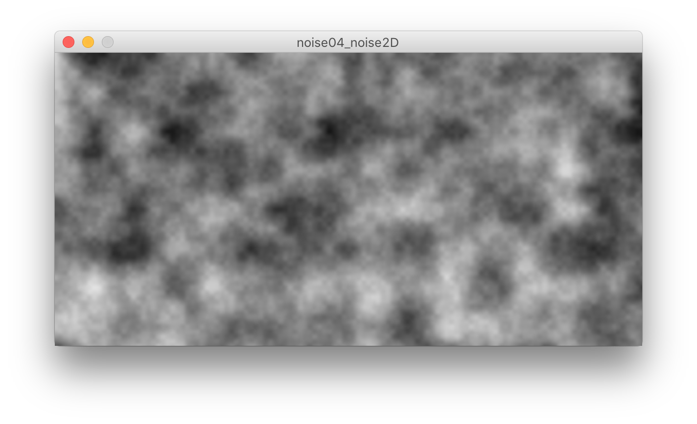


### 3D Example: ([../wk08/examples/noise/noise05_noise3D/](https://github.com/pds-nyu-idm-cc/DM-GY-6063-Creative-Coding-Spring-2019-Stearns/tree/master/wk08/examples/noise/noise05_noise3D))

```
float scale=.025;
int seed = 9999;
int octaves = 3;
float falloff = .5;
float z=0;
float zStep=.0025;

void setup() {
  size(600, 300);
  noiseSeed(seed);
  noiseDetail(octaves, falloff);
}

void draw() {
  drawNoise();
}

void drawNoise() {
  loadPixels();
  noiseDetail(4);
  for ( int y = 0; y < height; y++ ) {
    for ( int x = 0; x < width; x++ ) {
      pixels[y*width+x] = color(map(noise(x*scale, y*scale, z),0,1,0,255));
    }
  }
  z+=zStep;
  updatePixels();
}
```

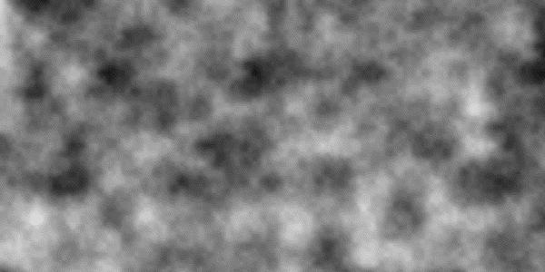


### Drawing with Noise ([..wk08/examples/overBreak/noiseDrawing/](https://github.com/pds-nyu-idm-cc/DM-GY-6063-Creative-Coding-Spring-2019-Stearns/tree/master/wk08/examples/overBreak/noiseDrawing))

We've already covered motion using PVectors. We also looked at acceleration. Acceleration is the result of some force acting on an object. Unless we're dealing with the masses of things, we can skip the math converting a force vector into an acceleration vector (`acceleration.add(force.div(mass))` for those who are interested).

This sketch treats the greyscale values like a magnetic forcefield of varying intensity. 50% grey is 0 force strength.

The vector of acceleration due to the force of a magnetic field on a charge in motion is given by:


Where:

* F is the force vector
* q is the charge of the particle
* v is the velocity vector
* B is the magnetic field vector
* X indicates a cross product, which produces a vector orthogonal to v and B

In the case of the example, the brightness of the perlin noise indicates the strength of a B field in the z axis.

Since we're ignoring charge and mass (considering them as 1), we can skip ahead and calculate the acceleration as:

```
velocity.copy().rotate(PI/2).setMag(velocity.mag()*magneticFieldStrength)
```
Lemme unpack this:

```
PVector aDueToForce = velocity.copy(); // copy the velocity vector
aDueToForce.rotate(PI/2); // rotate 90 degrees
magnitude = velocity.mag()*magneticFieldStrength; // we need to calculate the magnitude based on velocity and field strength
aDueToForce.setMag(magnitude); // then we apply that magnitude to the acceleration vector

```

And that's how we make spaghetti code:

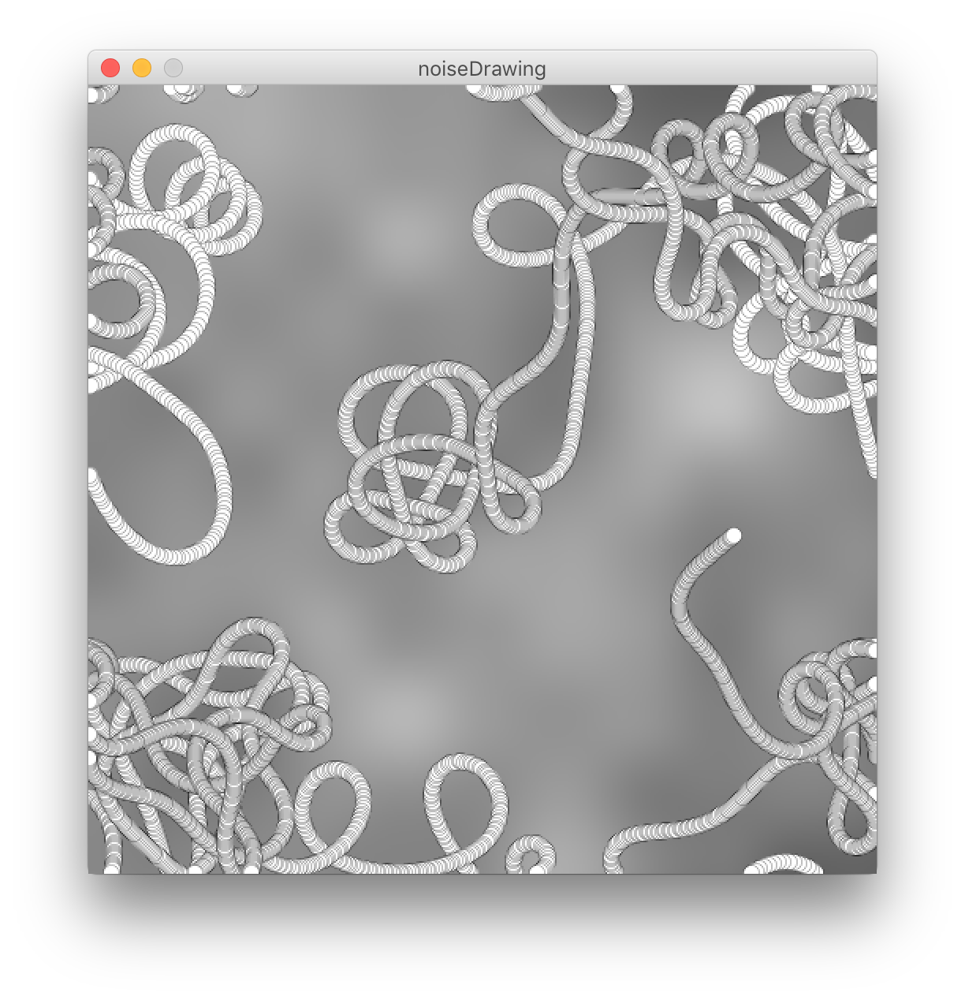

## Research Presentation:

```
String[] subjects = { "Seb Lee-Delisle", "Leo Villareal", "Jurg Lehni" };
Presenter rooShamim = new Presenter(subjects);

rooShamim.setQtySubjects(2);
rooShamim.givePresentation();

```

## Pixels

Pixels are the picture cells, the atoms of our digital visual world. In processing there are three different contexts in which we can work with pixels:

* The frame
* PImages
* PGraphics

### The Frame ([../wk08/examples/pixels/pixels01_frame/](https://github.com/pds-nyu-idm-cc/DM-GY-6063-Creative-Coding-Spring-2019-Stearns/tree/master/wk08/examples/pixels/pixels01_frame))

When you draw to the screen using a function like circle(), you're changing the value of the pixels in the main drawing context of our sketch, the Frame.

Consider this code:

```
int iterations = 300;
float radius;
void setup() {
  size(500, 500);
  background(0);
  noStroke();
  radius = width*1.5;
  drawCircles(radius, iterations);
}

void draw() {
}

void drawCircles(float _radius, int _depth) {
  int i = _depth - 1;
  fill(color(random(256), random(256), random(256)));
  circle(width/2, height/2, _radius);
  if (i>0) {
    drawCircles( i * _radius/_depth, i);
  }
}

void keyPressed(){
  drawCircles(radius, iterations);
}

void mousePressed(){
  loadPixels();
  color pixel = pixels[ mouseX + mouseY * width];
  float red = red(pixel);
  float green = green(pixel);
  float blue = blue(pixel);
  println("Red: "+red+", Green: "+green+", Blue: "+blue);
}
```

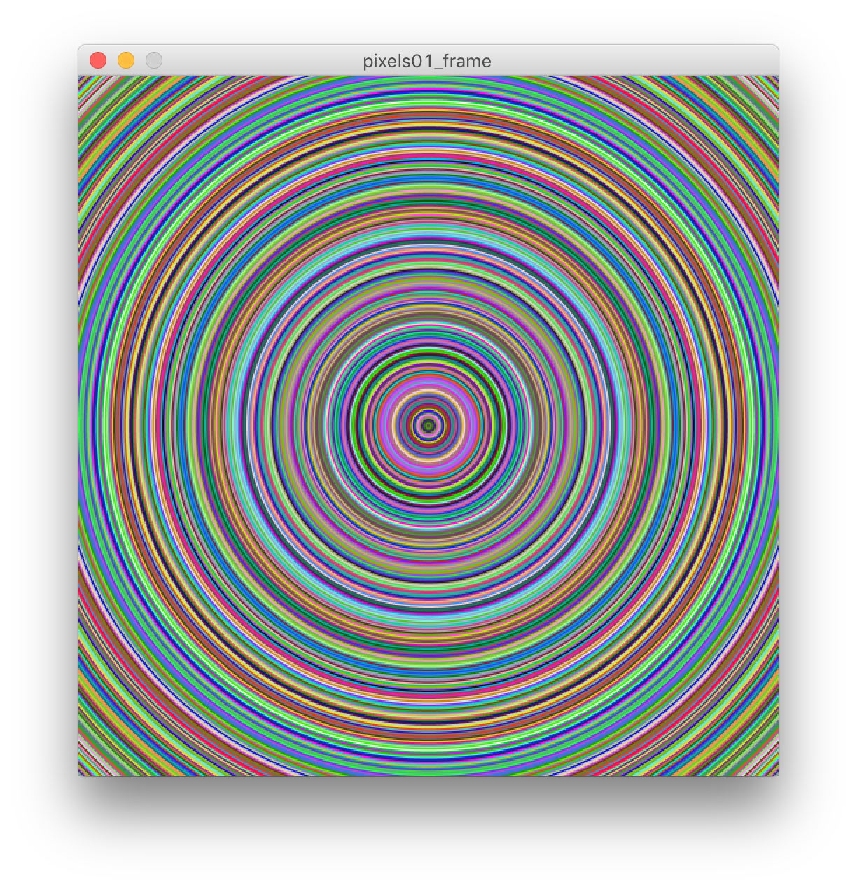

There are three things to note:

1. We recursively call the `drawCircles()` function.
2. `loadPixels()`
3. `color pixel = pixels[ mouseX + mouseY * width]`

### Writing to pixels[]: ([../wk08/examples/pixels/pixels02_frame/](https://github.com/pds-nyu-idm-cc/DM-GY-6063-Creative-Coding-Spring-2019-Stearns/tree/master/wk08/examples/pixels/pixels02_frame))

```
void setup(){
  size(600,300);
  colorPixels();
}

void draw(){
}

void colorPixels(){
  loadPixels();
  for(int i = 0 ; i < pixels.length ; i++){
    pixels[i]=color(random(256),random(256),random(256));
  }
  updatePixels();
}

void keyPressed(){
  colorPixels();
}

void mousePressed(){
  color pixel = pixels[ mouseX + mouseY * width];
  float red = red(pixel);
  float green = green(pixel);
  float blue = blue(pixel);
  println("Red: "+red+", Green: "+green+", Blue: "+blue);
}
```
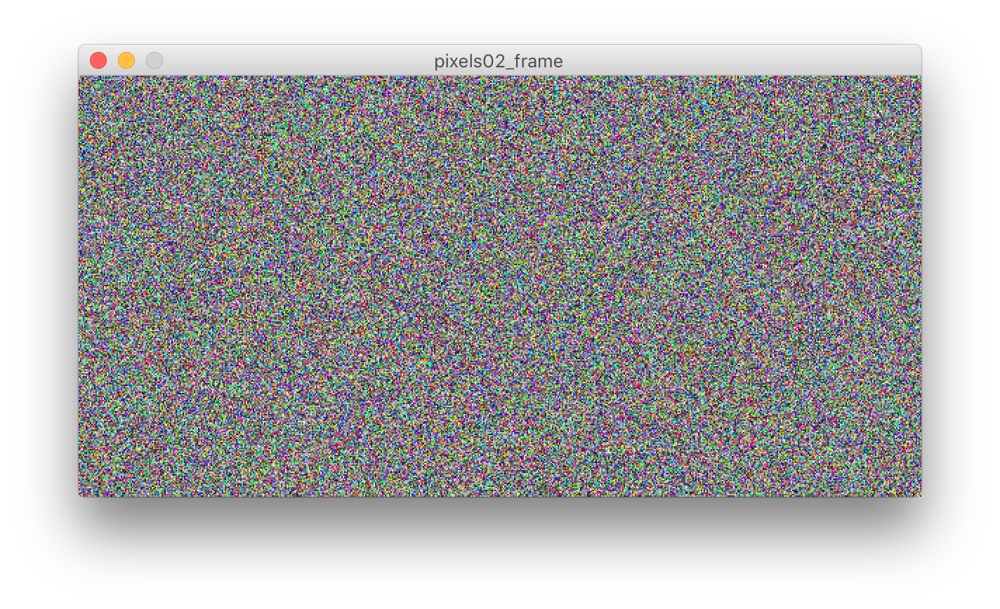

When we manipulate pixels in the frame, we have to begin with `loadPixels()`, and end with `updatePixels()`

### PImage

The PImage class defines image objects. Its fields are:

* `int width`
* `int height`
* `color[] pixels`

Its the methods are:

* `loadPixels()` - Loads the pixel data for the image into its `pixels[]` array
* `updatePixels()` - Updates the image with the data in its `pixels[]` array
* `resize()` - Changes the size of an image to a new width and height
* `get()` - Reads the color of any pixel or grabs a rectangle of pixels
* `set()` - writes a color to any pixel or writes an image into another
* `mask()` - Masks part of an image with another image as an alpha channel
* `filter()` - Converts the image to grayscale or black and white
* `copy()` - Copies the entire image
* `blend()` - Copies a pixel or rectangle of pixels using different blending modes
* `save()` - Saves the image to a TIFF, TARGA, PNG, or JPEG file

Full reference for the PImage class can be found [here](https://processing.org/reference/PImage.html).

#### Loading and Displaying ([../wk08/examples/pixelsorting/PImage_00/](https://github.com/pds-nyu-idm-cc/DM-GY-6063-Creative-Coding-Spring-2019-Stearns/tree/master/wk08/examples/pixelsorting/PImage_00))


Instead of using the syntax `PImage myImage = new PImage();`, we initialize PImage objects using `createImage()` or `loadImage()`.

1. Start a new Processing sketch. Save it and go to its containing folder.
2. Create a new folder called "images" in the same folder as your sketch.
3. Hop online and pick an image, any image. Save it in the image folder.
4. Next, copy the code below and modify it to display your image:

```
// create a PImage instance and name the object "img"
PImage img;

void setup(){
  
  // initialize our canvas dimensions
  size(500, 500);
  
  // use loadImage() to load an image into img
  img = loadImage("images/windows_xp_bliss-wide.jpg");
  
  // we only need to draw once
  noLoop();
  
}

void draw(){
  
  // draw our image, img to the canvas, at the given x, y coordinates
  image(img, 0, 0);
  
}

void mousePressed(){
  img.loadPixels();
  color pixel = img.pixels[ mouseX + mouseY * width];
  float red = red(pixel);
  float green = green(pixel);
  float blue = blue(pixel);
  println("Red: "+red+", Green: "+green+", Blue: "+blue);
}
```

* `loadImage()` loads an image from a file path or URL and returns a PImage object.
* `PImage.loadPixels()` loads the image data into the `PImage.pixels[]` array
* `image(PImage, int, int)` displays an image and the given x and y coordinates.
* `imageMode(CENTER)` remember this from our `rect()` and `ellipse()` functions?

You can write to a PImage in the same way as you would write to the Frame pixels[] array:

1. `PImage.loadPixels()` to load the image data into the image's pixels[] array
2. `PImage.pixels[ x + y*Pimage.width ] = color(someColor)` allows you to assign a color to a specific pixel
3. `PImage.updatePixels()` writes changes to the PImage.pixels[] array back to the image data

### PGraphics ([../wk08/examples/pixels/pixels03_PGraphics/](https://github.com/pds-nyu-idm-cc/DM-GY-6063-Creative-Coding-Spring-2019-Stearns/tree/master/wk08/examples/pixels/pixels03_PGraphics))

PGraphics require a slight shift in our thinking. The best way to think about PGraphics is to think about how you would work with building up a sketch in layers that would can turn on and off.

PGraphics is the main graphic context for Processing. When you're drawing to the Frame, you're actually writing to a PGraphics object. If you want to render things offscreen, on a hidden layer, you can create and draw into a PGraphics objectlike this:

```
PGraphics myGraphic;

void setup() {
  size(500, 500);
  myGraphic = createGraphics(width, height);
  background(255);
  drawRect(myGraphic);
}

void draw() {
  background(255);
  image(myGraphic, 0, 0);
}

void drawRect(PGraphics _graphic) {
  _graphic.beginDraw();
  _graphic.clear();
  _graphic.fill(color(random(256), random(256), random(256)));
  _graphic.rectMode(CENTER);
  _graphic.rect(width/2, height/2, width/(random(3)+1), height/(random(3)+1));
  _graphic.endDraw();
}

void keyPressed() {
  drawRect(myGraphic);
}
```

### Writing to PGraphics.pixels[]: ([../wk08/examples/pixels/pixels04_PGraphics/](https://github.com/pds-nyu-idm-cc/DM-GY-6063-Creative-Coding-Spring-2019-Stearns/tree/master/wk08/examples/pixels/pixels04_PGraphics))

Writing into the pixels of a PGraphics objects goes a little something like this:

```
PGraphics myGraphic;
color fillColor;
void setup() {
  size(500, 500);
  myGraphic = createGraphics(width, height);
  background(255);
  drawRect(myGraphic);
  fillColor = randomColor();
}

void draw() {
  background(255);
  image(myGraphic, 0, 0);
  rectMode(CENTER);
  fill(fillColor);
  rect(width/2, height/2, width/2, height/2);
}

void drawRect(PGraphics _graphic) {
  _graphic.beginDraw();
  _graphic.loadPixels();
  for (int i = 0; i < _graphic.pixels.length; i++) {
    _graphic.pixels[i]=color(random(256), random(256), random(256));
  }
  _graphic.updatePixels();
  _graphic.endDraw();
}

color randomColor(){
  return color(random(256),random(256),random(256));
}

void keyPressed() {
  drawRect(myGraphic);
}

void mousePressed(){
  fillColor = randomColor();
}

```

The advantage is that you can render your buttons and interface in one PGraphics context, and your art in separate one. Then when you want to save the artwork, your use `PGraphics.save("relative/path/to/yourFile.png");`